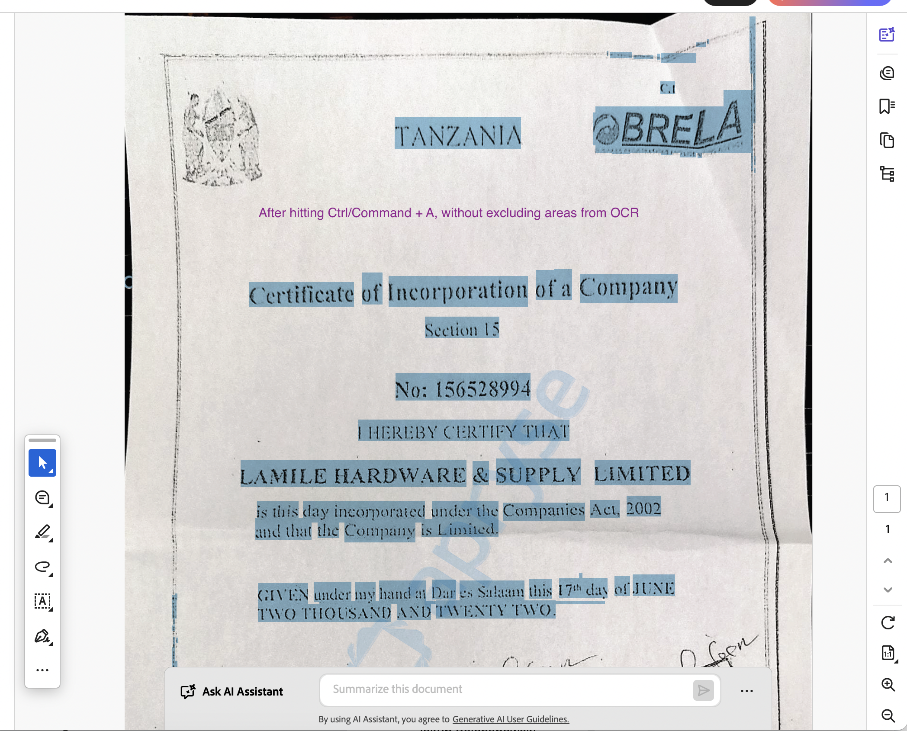
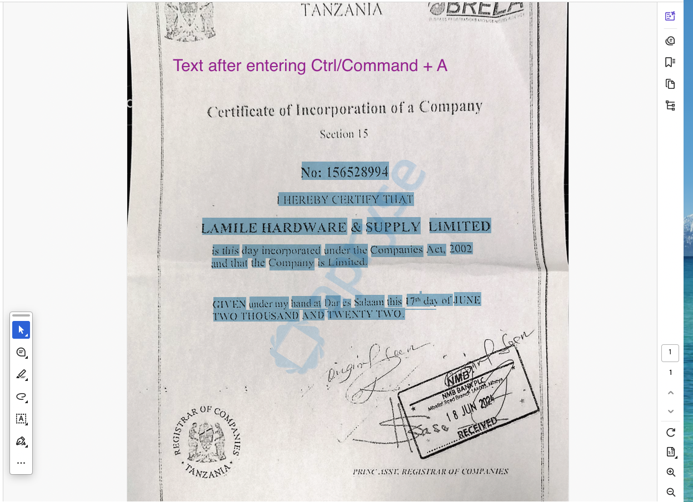

__Before running__

Please download IRIS binaries here & get key:
https://dev.apryse.com/

Key should be saved in a .env file on root level as 
PDFTRON_KEY=your-key-here

Then, please run npm i

In index.js, you can see where we isolate particular zones for OCR:

```javascript

          const page = await doc.getPage(1);
          const mediaBox = await page.getMediaBox();

          const pageHeight = mediaBox.y2 - mediaBox.y1;
          const pageWidth = mediaBox.x2 - mediaBox.x1;
          const zoneHeight = pageHeight * (1 / 3); 

          const bottomTwoThirdsZone = new PDFNet.Rect(
            mediaBox.x1 + (pageWidth * 0.12),               
            mediaBox.y1 + zoneHeight,                   
            mediaBox.x2 - (pageWidth * 0.12),                   
            mediaBox.y2  
          );
          console.log(
            `
            x1 mediaBox.x1 ${mediaBox.x1 + (pageWidth * 0.12)},               
            y1 mediaBox.y1 + zoneHeight ${mediaBox.y1 + zoneHeight},                  
            x2 mediaBox.x2 ${mediaBox.x2 - (pageWidth * 0.12)},                 
            y2 mediaBox.y2 ${mediaBox.y2},
            `
          )

          opts.addTextZonesForPage([bottomTwoThirdsZone], 1);

```

Please see difference between this:


And this:

